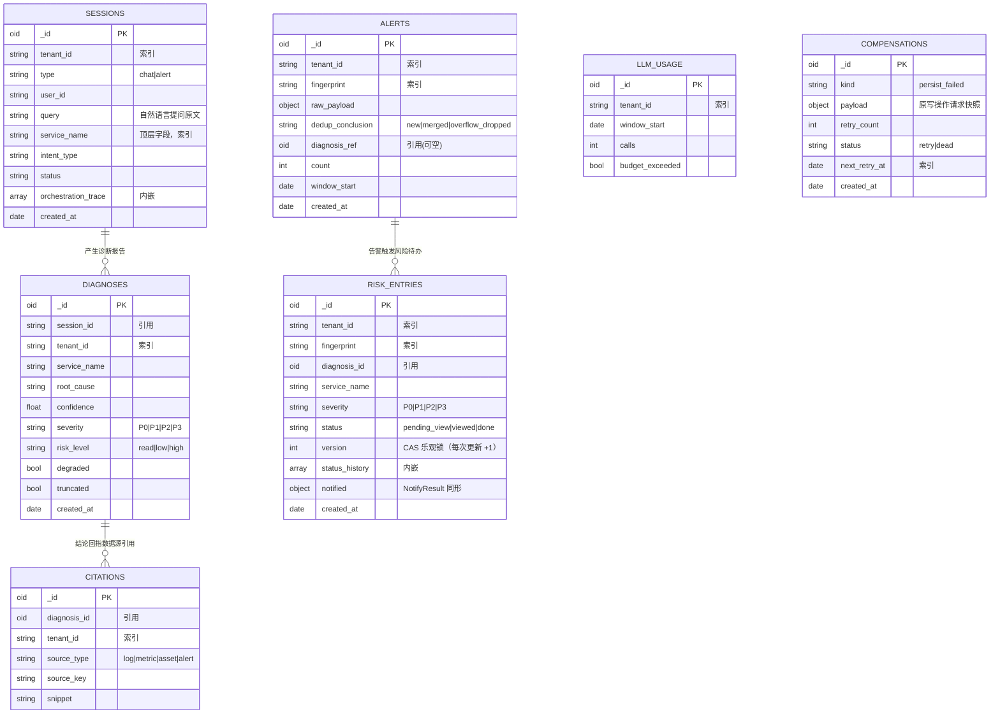

# ER Diagram: Haven 运维 Agent（编排层）

> **存储说明**：Haven 后端使用 **MongoDB**（`go.mongodb.org/mongo-driver`），本 ER 图以「集合（collection）」为实体，`_id` 为 ObjectId 主键，引用以「文档引用」（存目标 `_id`/业务键）表达，非 SQL 外键。数据库为独立库 `opsagent`。所有集合均带 `tenant_id` 字段并建租户复合索引（多租户隔离硬约束）。

## Entity Relationships

> **建模说明**：`orchestration_trace` 为 sessions 文档**内嵌数组**（非独立实体，故不出现在关系图中）；`llm_usage` 为**租户级滚动 1h 窗口账本**（每租户每窗口一行，非会话子实体），会话与 LLM 调用的关联通过 orchestration_trace 中的调用记录表达，因此二者均不建立「一对多」关系连线；`compensations` 为**独立补偿队列**（payload 自包含原写操作快照，不外键引用业务集合——目标文档可能尚未落成），故亦无关系连线，唯一属主为 `internal/worker` 补偿重试循环。

## Entity Details

### sessions [NEW]

| Field | Type | Constraints | Description |
|-------|------|-------------|-------------|
| _id | ObjectId | PK | 会话主键 |
| tenant_id | string | NOT NULL, indexed | 租户标识（eiam 派生） |
| type | string | enum: chat\|alert | 触发来源：对话 / 告警 |
| user_id | string | NOT NULL | 发起人（对话）或告警来源标识 |
| query | string | | 用户自然语言提问原文（对话）；alert 类型存触发摘要 |
| service_name | string | indexed | 涉及服务名（抽取自 query / 告警载荷，供历史检索） |
| intent_type | string | enum: diagnose\|resource\|out_of_scope | 意图分类结果 |
| intent_confidence | float | 0~1 | 意图置信度 |
| correction_log | array | 内嵌 | 误分类 + 纠正记录 |
| orchestration_trace | array | 内嵌 | 编排调用链（step: agent/tool/底座/耗时/摘要） |
| status | string | enum: running\|done\|failed | 会话状态 |
| created_at | date | NOT NULL | 创建时间 |
| updated_at | date | NOT NULL | 更新时间 |

### diagnoses [NEW]

| Field | Type | Constraints | Description |
|-------|------|-------------|-------------|
| _id | ObjectId | PK | 诊断主键 |
| session_id | string | NOT NULL, indexed | 关联会话 |
| tenant_id | string | NOT NULL, indexed | 租户 |
| service_name | string | indexed | 受影响服务 |
| root_cause | string | NOT NULL | 根因结论 |
| confidence | float | 0~1 | 置信度 |
| severity | string | enum: P0\|P1\|P2\|P3 | 严重性 |
| risk_level | string | enum: read\|low\|high | 风险档（注册表判定） |
| conclusions | array | 内嵌 | 结论列表（每条含结论文本 + 引用键） |
| disposition | array | 内嵌 | 处置预案步骤清单 |
| score_detail | array | 内嵌 | 多维度评分（时间相关/拓扑距离/错误频率/变更关联/指标异常） |
| degraded | bool | default false | LLM 降级标识 |
| truncated | bool | default false | 结果截断标识 |
| created_at | date | NOT NULL | 创建时间 |

### citations [NEW]

| Field | Type | Constraints | Description |
|-------|------|-------------|-------------|
| _id | ObjectId | PK | 引用主键 |
| diagnosis_id | string | NOT NULL, indexed | 关联诊断 |
| tenant_id | string | NOT NULL, indexed | 租户 |
| source_type | string | enum: log\|metric\|asset\|alert | 数据源类型 |
| source_key | string | NOT NULL | 源标识（logquery 查询 id / 资产 id / 告警 id） |
| snippet | string | | 引用片段（截断） |
| fetched_at | date | | 获取时间 |

### alerts [NEW]

| Field | Type | Constraints | Description |
|-------|------|-------------|-------------|
| _id | ObjectId | PK | 告警主键 |
| tenant_id | string | NOT NULL, indexed | 租户 |
| fingerprint | string | NOT NULL, indexed | 指纹（租户+服务+指标+级别） |
| raw_payload | object | NOT NULL | 告警原文（窗口首条与溢出丢弃留档均保留） |
| dedup_conclusion | string | enum: new\|merged\|overflow_dropped | 记账结论：窗口首条建文档（new）/ 同指纹归并（merged，$inc count）/ 队列溢出丢弃留档（overflow_dropped） |
| diagnosis_ref | string | nullable | 关联诊断（可空） |
| count | int | default 1 | 窗口内到达计数（首条为 1，同指纹归并时 $inc） |
| window_start | date | NOT NULL | 滚动窗口起点 |
| created_at | date | NOT NULL | 到达时间 |

### risk_entries [NEW]

| Field | Type | Constraints | Description |
|-------|------|-------------|-------------|
| _id | ObjectId | PK | 风险待办主键 |
| tenant_id | string | NOT NULL, indexed | 租户 |
| fingerprint | string | indexed | 告警指纹 |
| diagnosis_id | string | indexed | 关联诊断 |
| service_name | string | indexed | 服务名 |
| severity | string | enum: P0\|P1\|P2\|P3 | 严重性 |
| status | string | enum: pending_view\|viewed\|done | 状态（待查看/已查看/已处理） |
| version | int | ≥ 1, NOT NULL | CAS 乐观锁版本：创建时置 1，每次成功更新 +1；状态更新以 `{_id, tenant_id, version}` 过滤 findAndModify，不匹配 → 409（对应 API `expectedVersion`） |
| status_history | array | 内嵌 | 状态流转历史（含操作人/时间） |
| notified | object | | 通知发送结果（渠道/时间/重试/失败） |
| created_at | date | NOT NULL | 创建时间 |
| updated_at | date | NOT NULL | 更新时间 |

### llm_usage [NEW]

| Field | Type | Constraints | Description |
|-------|------|-------------|-------------|
| _id | ObjectId | PK | 用量主键 |
| tenant_id | string | NOT NULL, indexed | 租户 |
| window_start | date | NOT NULL, indexed | 滚动 1h 窗口起点 |
| calls | int | default 0 | 调用次数 |
| budget_exceeded | bool | default false | 预算是否耗尽 |

### compensations [NEW]

| Field | Type | Constraints | Description |
|-------|------|-------------|-------------|
| _id | ObjectId | PK | 补偿项主键 |
| kind | string | enum: persist_failed | 补偿类型（P1 仅落库失败重放） |
| payload | object | NOT NULL | 原写操作请求快照（自包含，重放所需全部字段） |
| retry_count | int | default 0 | 已重试次数（上限 5，达上限 → dead） |
| status | string | enum: retry\|dead | 待重试 / 死信（dead 附运维告警） |
| next_retry_at | date | NOT NULL, indexed | 下次重试时间（扫描谓词） |
| created_at | date | NOT NULL | 首次入队时间 |

> 唯一属主：`internal/worker` 补偿重试循环——每 30s 扫描 `idx_comp_retry`（status=retry 且 next_retry_at ≤ now）逐条重放；成功即删除，重试 5 次仍失败标 `dead` + 推送运维告警。落库失败方只写入，不重放。

### settings [NEW]

| Field | Type | Constraints | Description |
|-------|------|-------------|-------------|
| _id | ObjectId | PK | 配置主键 |
| tenant_id | string | indexed | 租户；**全局配置文档存空串 `""`（哨兵值）**，与租户文档共用唯一索引不冲突 |
| scope | string | enum: datasource\|llm\|notify\|risk_whitelist\|preset_queries\|guided_templates | 配置作用域（`preset_queries` 承载 L2 降级预置查询目录；`guided_templates` 承载引导话术映射：超能力意图类型 → 话术模板 + 正确渠道/系统入口，Flow C 用） |
| value | object | NOT NULL | 配置内容（数据源/LLM 提供商/渠道开关/白名单） |
| updated_at | date | NOT NULL | 更新时间 |

## Index Design

| Collection | Index Name | Fields | Type | Description |
|------------|-----------|--------|------|-------------|
| sessions | idx_sessions_tenant_time | (tenant_id, created_at) | compound | 历史检索（时间+租户，SC-5） |
| sessions | idx_sessions_service | (tenant_id, service_name) | compound | 按服务名检索 |
| diagnoses | idx_dx_session | session_id | single | 会话→诊断关联 |
| diagnoses | idx_dx_tenant_service | (tenant_id, service_name) | compound | 按服务过滤 |
| citations | idx_cit_dx | diagnosis_id | single | 诊断→引用 |
| alerts | idx_alerts_fingerprint_window | (tenant_id, fingerprint, window_start) | compound | 指纹去重窗口查询 |
| risk_entries | idx_re_tenant_status | (tenant_id, status) | compound | 风险中心筛选 |
| risk_entries | idx_re_tenant_service | (tenant_id, service_name) | compound | 按服务筛选 |
| llm_usage | idx_llm_tenant_window | (tenant_id, window_start) | compound | 预算窗口聚合 |
| compensations | idx_comp_retry | (status, next_retry_at) | compound | 补偿重试扫描（retry 且到期；与 schema.mongo.js 一致） |

## Relationships

| From | To | Cardinality | Business Meaning |
|------|----|-------------|------------------|
| sessions | diagnoses | one-to-many | 一次会话产生一份（或零份）诊断报告 |
| diagnoses | citations | one-to-many | 一份报告的多条结论回指多个数据源引用 |
| alerts | risk_entries | one-to-many | 一条告警（首次触发）产生一条风险待办；归并告警不新增 |

> `llm_usage` 不与 sessions 建关系：它是租户 × 1h 窗口粒度的预算账本（`window_start` + `calls`），不是会话子实体。

## Change Impact Analysis

所有集合均为 [NEW]（编排层新增库），无既有表变更、无数据迁移。