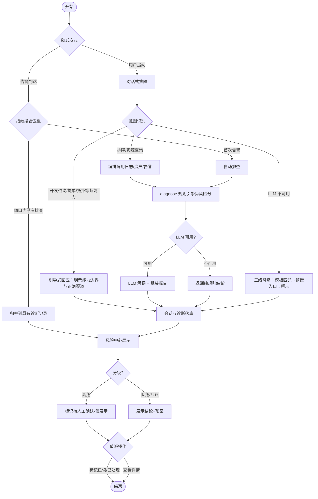

# Haven 运维 Agent — PRD Spec

> PRD Spec: defines WHAT the feature is and why it exists.
> 本 PRD 只覆盖 P1「排障核心闭环」；P2/P3 见 proposal（`docs/proposals/haven-opsagent/proposal.md`），不在本 PRD 范围内。

## Background

### Why (Reason)

现有 OpsAgent 只是一套脱离真实运维平台的「空壳」：6 个 markdown skill 指向外部通用云源（Prometheus / SLS / ARMS / GitHub），与 `D:\Haven` 运维平台的真实数据与能力零对接。Haven 平台本身已具备日志联邦查询（logquery）、刷量诊断规则引擎（diagnose）、告警（alert）、审计（audit）、拓扑（topology）、资产 MCP、eiam 鉴权等成熟底座，但无统一智能编排层——排障仍需人工在多个系统间切换串联。基线运营指标（初估，P1 启动前以 alert/audit 历史数据核实）：月均告警约 3000 条、单次「告警→定位」人工串联 20–40 分钟、每月 60–100 人时耗在机械串联、MTTR 1–2 小时、同类告警重复占比 ≥ 30%。

### What (Target)

在 Haven 内新增一个「运维 Agent」子模块，纯编排层复用现有底座，P1 交付「排障核心闭环」：对话式排障助手 + 告警主动触发 + 对话窗口/风险中心双界面 + 只读诊断与处置预案 + 会话与诊断落库回溯 + eiam 鉴权与租户隔离。

### Who (Users)

- **一线值班运维**：接收告警主动推送、在风险中心查看/标记待办、用对话做快速故障定位。
- **资深运维 / SRE**：用对话做深度排障、回溯历史诊断记录、依赖诊断报告的数据源引用做二次核实。

## Goals

| Goal | Metric | Notes |
|------|--------|-------|
| 缩短「告警→定位」单次耗时 | 从人工串联 20–40 分钟/次 → Agent 端到端 ≤ 1 分钟（含 LLM 解读） | 指标口径：端到端含报告组装（proposal SC-1） |
| 告警主动处置覆盖 | 预置测试环境注入 N≥100 条标准告警，端到端（告警→落库诊断→风险中心可见）成功率 ≥ 99% | 外部渠道推送成功率单独统计 ≥ 99%（proposal SC-2） |
| 减少人工机械串联 | P1 落地后排障主链路（日志+资产+告警）由编排层自动串联 | 以「无需人工跨系统切换」为定性目标 |
| 可回溯 | 任一诊断会话完整落库，1 分钟内可按租户/时间/服务名检索 | 落库完整率 100%（proposal SC-5） |

## Scope

### In Scope

- [ ] 对话式排障助手：自然语言意图识别 → 编排调用日志/资产/告警 → 只读诊断报告（结论含数据源引用）
- [ ] 意图识别与能力路由边界：将用户意图分类到「排障诊断 / 资源查询 / 超能力意图」，排障与资源查询走编排处理，开发咨询 / 提单 / 链路拓扑等超能力意图走「引导式回应」（明示能力边界并指引正确渠道，不真实转发）
- [ ] 告警主动触发：告警唤醒 → 自动排查 → 推送「结论 + 分级处置预案」到风险中心；含告警风暴防护（指纹聚合去重 / 并发上限 / LLM 调用预算）
- [ ] 双界面载体：对话窗口（主入口）+ 风险中心（结构化待办列表）
- [ ] 风险中心 P1 交互：查看详情、标记已读/已处理、按租户/时间/服务名筛选（仅展示+状态标记，无确认执行）
- [ ] 会话与诊断结果落库回溯
- [ ] eiam 鉴权 + 租户隔离（查询侧 + LLM 输入输出侧）
- [ ] 对话链路 LLM 降级三级（模板意图匹配 → 预置查询入口 → 明示降级模式）
- [ ] 底座接口契约文档 + 契约测试（P1 显式交付物）

### Out of Scope

- 写操作执行 / 高危人工确认执行流（P3）
- 历史故障库 + SOP 语义检索（P2）
- audit / 工单（ecmdb order）/ topology 接入（P2）
- CI/CD 数据源接入（P3）
- 数据面新建（CI/CD 系统、日志存储、工单系统本身）
- 全自动无人值守执行

## Flow Description

### Business Flow Description

**主流程 A：对话式排障（S1）**

用户以自然语言提问（如「order-service 最近一小时错误率上升，帮我看看」）→ Agent 做意图识别与参数抽取（服务名、时间窗、指标类型）→ **意图分类路由**：排障诊断 / 资源查询 → 编排层按意图调用底座（logquery 拉取错误日志 / 告警 / 资产）→ diagnose 规则引擎算风险分 → LLM 解读并组装报告 → 返回含根因 + 处置建议 + 数据源引用的只读诊断报告 → 会话与诊断落库。开发咨询 / 提单 / 链路拓扑等超能力意图 → 引导式回应：明示「这是 X 类问题，请走 Y 渠道」，不真实转发、不猜测执行。异常分支：LLM 不可用 → 三级降级（模板意图匹配 / 预置查询入口 / 明示降级）；底座接口超时 → 返回确定性规则引擎结论，不因 AI 失效中断主路径。

**主流程 B：告警主动触发（S2）**

告警到达 → 编排层按指纹聚合去重（滚动窗口内同指纹仅一次排查，防风暴）→ 自动跑排查 → 生成诊断 + 分级处置预案 → 推送风险中心。高危项标记「待人工确认（执行通道 P3 上线后生效）」，P1 仅展示不出确认按钮。异常分支：LLM 预算耗尽 → 降级纯规则结论；队列溢出 → 丢弃低级别告警排查、保留告警原文与去重结论。

**主流程 C：超能力意图引导（S7）**

用户问开发咨询 / 提单 / 链路拓扑 / 闲聊等超出 P1 编排能力的问题 → 意图分类识别为「超能力意图」→ 编排层不调用任何底座、不猜测执行 → 返回引导式回应：明示「这是 X 类问题，请走 Y 渠道/系统」，给出预设话术与正确入口提示 → 该轮会话落库（供回溯「用户问过什么、被引导到哪」）。

**关键状态流转**：

风险中心条目状态机：`待查看` → `已查看` → `已处理`（人工标记）。状态仅记录值班处理进度，不触发任何写操作。

### Business Flow Diagram

### Data Flow Description

| Data Flow ID | Source System | Target System | Data Content | Transport | Frequency | Format | Notes |
|-----------|--------|----------|----------|----------|------|------|------|
| DF001 | alert（挖掘/告警链路） | Agent 编排层 | 告警事件（服务名、指标阈值、级别、时间窗） | 内部接口 | 实时/事件驱动 | 结构化 | 触发主动排查 |
| DF002 | Agent 编排层 | logquery | 日志查询请求（日志类型×云×账号×资源×时间范围） | 内部接口 | 按需 | 结构化 | 只读 |
| DF003 | logquery | Agent 编排层 | 联邦日志结果 + diagnose 风险分 | 内部接口 | 按需 | 结构化 | 供 LLM 组装报告 |
| DF004 | Agent 编排层 | 资产/MCP | 资产查询（ECS/RDS/Redis 等） | MCP Tools / 内部接口 | 按需 | 结构化 | 判定「查什么」能力清单 |
| DF005 | eiam | Agent 编排层 | 鉴权结论 + 租户上下文 | 中间件 | 每次请求 | 结构化 | 强制注入 tenant 谓词 |
| DF006 | Agent 编排层 | 落库存储 | 会话内容 + 诊断报告 + 数据源引用 | 内部接口 | 每次诊断 | 结构化 | 可回溯，1 分钟可检索 |

## Functional Specs

> UI 功能规格详见 [prd-ui-functions.md](./prd-ui-functions.md)。

### Related Changes

| # | Project | Module | Change Point | Updated Logic |
|------|----------|----------|------------|----------------|
| 1 | Haven（e-cam-service 等） | logquery / alert / 资产 / eiam | 导出稳定 service 接口 / MCP Tools，作为编排层契约 | 冻结接口清单为契约文档，破坏性变更需新增方法保留旧方法 |
| 2 | Haven | — | 新增 Agent 编排层子模块 | 新增，不改现有模块实现 |

## Other Notes

### Performance Requirements

- Response time: 规则诊断引擎（不含 LLM）< 秒级；端到端排障（含 LLM 解读 + 报告组装）≤ 1 分钟
- Concurrency: 告警自动排查并发上限默认 5，超出排队；LLM 解读调用每滚动 1 小时设次数上限（预算化）
- Data storage: 会话 + 诊断报告落库
- Compatibility: 复用 Haven 现有栈；无新平台要求

### Data Requirements

- Data tracking: 会话、编排调用链、诊断报告、数据源引用全部落库
- Data initialization: 无外部初始化数据；底座接口与数据已存在
- Data migration: 无

### Monitoring Requirements

- 编排层调用底座接口的成功率、超时率监控
- LLM 预算耗尽、降级触发次数监控
- 契约测试在 CI 中守护接口漂移

### Security Requirements

- Transport encryption: 复用 eiam 现有会话与传输安全
- Storage encryption: 诊断/会话含运维数据，按 Haven 现有存储加密策略
- Display masking: 跨租户数据不可见，LLM 回复引用校验越界丢弃
- Rate limiting: 告警风暴防护（指纹聚合 + 并发上限 + LLM 预算）

<!-- Override: Security review enabled by signal "鉴权/权限/加密/租户" -->
<!-- Override: API handbook enabled by signal "接口契约" (light: contracts are with existing modules) -->

---

## Quality Checklist

- [x] Is the requirement title accurate and descriptive
- [x] Does the background include all three elements: reason, target, users
- [x] Are the goals quantified
- [x] Is the flow description complete
- [x] Does the business flow diagram exist (Mermaid format)
- [x] Is prd-ui-functions.md referenced and UI specs complete
- [x] Are related changes thoroughly analyzed
- [x] Are non-functional requirements considered (performance / data / monitoring / security)
- [x] Are all tables filled completely
- [x] Is there any ambiguous or vague wording
- [x] Is the spec actionable and verifiable